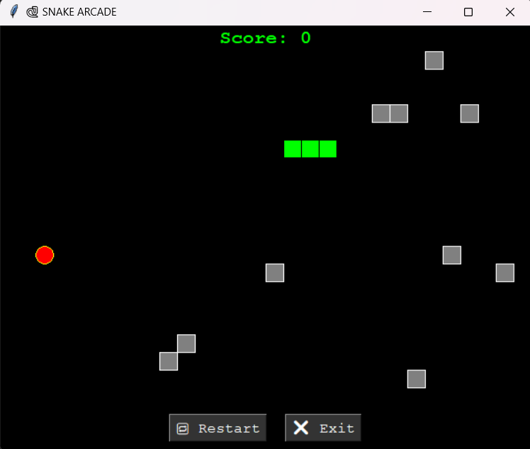
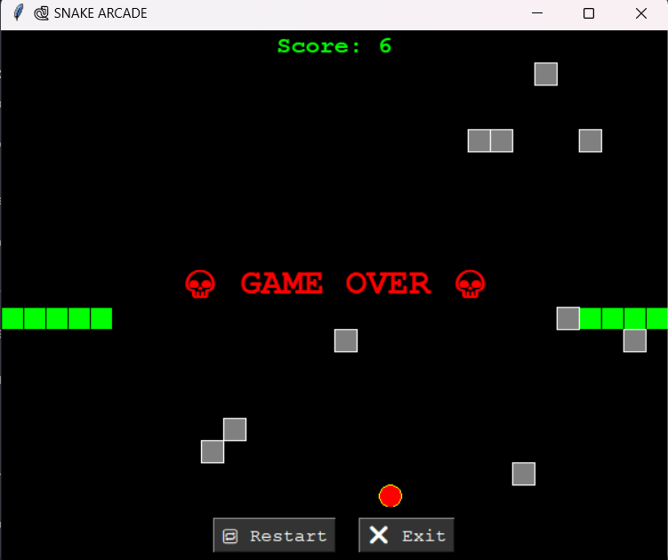

# 🐍 Snake Arcade

A retro‑styled Snake game with wrap‑around movement, obstacles, and a live scoreboard — built in Python with Tkinter.



## ✨ Features
- 🎮 Arcade‑style visuals with retro font and colors
- 🌍 Wrap‑around movement
- 🧱 Randomly generated obstacles
- 📊 Live scoreboard
- 🔁 Restart & ❌ Exit buttons

## 🚀 How to Run
1. Make sure you have Python 3 installed.
2. Enjoy the game !!!


---

**Controls**
List the keys clearly:
```markdown
## 🎯 Controls
- ⬆️ Up Arrow – Move Up
- ⬇️ Down Arrow – Move Down
- ⬅️ Left Arrow – Move Left
- ➡️ Right Arrow – Move Right

## 🔮 Future Ideas
- Add sound effects
- Save high scores to a file
- Multiple difficulty levels
- Snake skins
Please follow for more such projects..
Thank you guys !!!